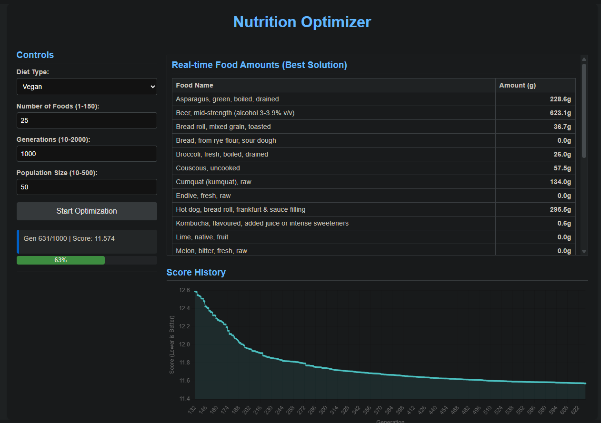

# Genetic Algorithm Nutrition Optimizer

This project uses a Genetic Algorithm (GA) to optimize meal plans based on nutritional data from the [Australian Food Composition Database Nutrient Excel spreadsheet](https://www.foodstandards.gov.au/science-data/monitoringnutrients/afcd/australian-food-composition-database-download-excel-files#nutrient). The goal is to find combinations and quantities of foods that best meet Recommended Daily Intake (RDI) targets for various nutrients, while considering optional dietary restrictions (like vegan or WFPB).

The application can be run either as a Command Line Interface (CLI) tool or as an interactive Web User Interface (Web UI) built with Flask and SocketIO.



## Features

*   **Nutritional Optimization:** Employs a Genetic Algorithm to find optimal food combinations and amounts.
*   **RDI Targeting:** Aims to meet configurable RDI values for a wide range of nutrients.
*   **Customizable Diets:** Supports filtering foods based on diet types (e.g., `all`, `vegan`, `wfpb`, `nutrient_dense`) defined in JSON configuration files.
*   **Dual Interface:**
    *   **CLI Mode:** Run optimizations directly from the command line.
    *   **Web UI Mode:** Provides an interactive web interface using Flask, allowing users to set parameters, start optimizations, and view results in real-time.
*   **Real-time Web Updates:** The Web UI displays:
    *   The list of randomly selected foods for the current optimization.
    *   Live updates on the best score achieved per generation.
    *   A real-time line chart showing the score progression over generations.
    *   A table showing the amounts (in grams) of each food in the best solution of the current generation, updated live.
*   **Data Source:** Reads nutritional information from the Australian Food Composition Nutrient Database "Release 2 - Nutrient file.xlsx".
*   **Configurable RDI:** RDI targets, Upper Limits (UL), units, and nutrient properties (e.g., water/fat-soluble) are defined in `rdi/rdi.json`.
*   **Detailed Reporting:** Generates comprehensive JSON and user-friendly HTML reports for each successful optimization run, saved in the `recipes/` directory.
*   **History Tracking:** Logs key metrics for each generation across runs in `optimization_history.csv`.
*   **Automatic Indexing:** Creates/updates `recipes/html/index.html` providing a sortable overview and links to all generated HTML reports. Also generates this `README.md` file with an updated list (if run via CLI).
*   **Recipe Cleanup:** Automatically removes older or poorly performing recipes based on score and quantity thresholds to manage storage.
*   **Asynchronous Web Operations:** Uses `eventlet` and `Flask-SocketIO` for efficient handling of background optimization tasks and real-time communication in the Web UI.


## Requirements

*   Python 3.8+
*   Required libraries: `Flask`, `Flask-SocketIO`, `eventlet`, `pandas`, `numpy`, `openpyxl`

## Installation

1.  **Clone the repository (if applicable):**
    ```bash
    git clone <your-repository-url>
    cd <repository-directory>
    ```
2.  **Install dependencies:**
    ```bash
    pip install -r requirements.txt
    # Or manually:
    # pip install Flask Flask-SocketIO eventlet pandas numpy openpyxl
    ```
    *Note: `eventlet` is crucial for the asynchronous features of the Web UI.*

## Usage

### 1. Web UI Mode

This mode provides an interactive browser interface.

1.  **Start the server:**
    ```bash
    python app-web.py --webui
    ```
    *(Ensure `eventlet.monkey_patch()` runs correctly at the start of the script as indicated by console output).*
2.  **Access the UI:** Open your web browser and navigate to `http://127.0.0.1:5000` (or `http://<your-server-ip>:5000` if running on a different machine/network interface).
3.  **Interact:**
    *   Select the desired **Diet Type**.
    *   Choose the **Number of Foods** to randomly select for optimization.
    *   Set the number of **Generations** and **Population Size** for the GA.
    *   Click **"Start Optimization"**.
    *   Observe the **Status** updates, **Progress Bar**, real-time **Score Chart**, and the **Real-time Food Amounts** table.
    *   Once complete, links to the generated **HTML Report** will appear.

### 2. Command Line Interface (CLI) Mode

This mode runs optimizations directly in the terminal, useful for batch processing or scripting.

1.  **Run a default optimization:** (Runs one optimization for each diet type defined in the script, using random parameters for food count and generations)
    ```bash
    python app-web.py
    ```
2.  **Run with specific parameters:** (Overrides the random generation/food counts for all diet types run in that session)
    ```bash
    python app-web.py --generations 200 --foods 30
    ```
3.  **Output:** The CLI mode will print progress updates, a summary report for each completed optimization to the console, save detailed JSON/HTML reports to the `recipes/` directory, update the history CSV, and regenerate the index files (`recipes/html/index.html` and `README.md`).

## Configuration

*   **Nutritional Data:** Ensure the `"Release 2 - Nutrient file.xlsx"` is present and the sheet name ("All solids & liquids per 100g") is correct in `_load_data`. Column names in the Excel file should match the keys used in `rdi.json`.
*   **RDI Targets:** Modify `rdi/rdi.json`. Each key is the nutrient name (matching the Excel column header). The value is an object containing:
    *   `rdi`: Recommended Daily Intake value.
    *   `ul`: Tolerable Upper Intake Level (optional, used for penalties).
    *   `unit`: Display unit (e.g., "mg", "g", "μg").
    *   `water_soluble`, `fat_soluble`, `is_mineral`: Boolean flags (optional) used by the scoring function to apply different overage penalties.
*   **Diet Types:** Add or modify JSON files in the `diets/` folder. Each file should be named `<diet_name>.json` (e.g., `vegan.json`). The structure is:
    ```json
    {
      "included_terms": ["Plant-Based", "Tofu", ...], // Optional: Keep only foods containing these terms
      "excluded_terms": ["Cheese", "Meat", "Honey", ...] // Optional: Remove foods containing these terms
    }
    ```
    Terms are case-insensitive. Inclusion is applied before exclusion.

## Output

*   **JSON Reports (`recipes/json/`):** Detailed data for each meal plan, including run info, penalties, food quantities, and full nutrition profile. Filename format: `meal_<run_number>_<timestamp>.json`.
*   **HTML Reports (`recipes/html/`):** User-friendly formatted reports viewable in a web browser. Filename format: `meal_<run_number>_<timestamp>.html`.
*   **HTML Index (`recipes/html/index.html`):** A sortable table listing all generated HTML reports with key metrics.
*   **README Index (`README.md`):** The "Generated Recipes Index" section below is automatically updated when the script is run in CLI mode.
*   **History (`optimization_history.csv`):** CSV file logging the best score per generation for each run.

## How it Works (Briefly)

The script uses a Genetic Algorithm:

1.  **Initialization:** A population of random potential meal plans (solutions) is created. Each solution consists of random amounts of the selected foods.
2.  **Evaluation:** Each solution is evaluated based on how closely its calculated nutrient totals match the target RDI values for a single meal (scaled from the daily RDI). A score is calculated, penalizing deviations from the target (with different penalties for being under RDI, over RDI, over UL, and specific penalties for excess soluble vitamins). Lower scores are better.
3.  **Selection:** Solutions with better (lower) scores are more likely to be selected as "parents" for the next generation. Elitism ensures the very best solutions are carried over directly.
4.  **Crossover:** Pairs of parent solutions are combined (e.g., blending their food amounts) to create new "child" solutions, inheriting traits from both parents.
5.  **Mutation:** A small random change is applied to some child solutions (e.g., slightly increasing or decreasing the amount of a random food) to introduce new variations and prevent premature convergence.
6.  **Repeat:** The evaluation, selection, crossover, and mutation steps are repeated for a specified number of generations.
7.  **Result:** The best solution (lowest score) found across all generations is presented as the optimized meal plan.


